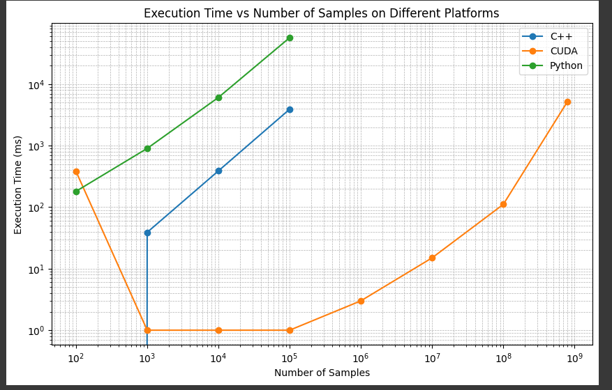

### monte carlo cpp naiive

l = 2, r = 13

```
---------------------------------------
Num samples     - 100
Trapesoid       - 68963
TIME DURATION   - 0 milliseconds
---------------------------------------
---------------------------------------
Num samples     - 10000
Trapesoid       - 76613
TIME DURATION   - 39 milliseconds
---------------------------------------
---------------------------------------
Num samples     - 100000
Trapesoid       - 76871
TIME DURATION   - 389 milliseconds
---------------------------------------
---------------------------------------
Num samples     - 1000000
Trapesoid       - 76914
TIME DURATION   - 3910 milliseconds
---------------------------------------
```

### monte carlo cpp curand + thrust

```
---------------------------------------
Num samples     - 100
Trapesoid       - 77207.5
TIME DURATION   - 383 milliseconds
---------------------------------------
---------------------------------------
Num samples     - 1000
Trapesoid       - 77207.5
TIME DURATION   - 1 milliseconds
---------------------------------------
---------------------------------------
Num samples     - 10000
Trapesoid       - 77207.5
TIME DURATION   - 1 milliseconds
---------------------------------------
---------------------------------------
Num samples     - 100000
Trapesoid       - 77207.5
TIME DURATION   - 1 milliseconds
---------------------------------------
---------------------------------------
Num samples     - 1000000
Trapesoid       - 77207.5
TIME DURATION   - 3 milliseconds
---------------------------------------
---------------------------------------
Num samples     - 10000000
Trapesoid       - 77207.5
TIME DURATION   - 15 milliseconds
---------------------------------------
---------------------------------------
Num samples     - 100000000
Trapesoid       - 77207.5
TIME DURATION   - 111 milliseconds
---------------------------------------
---------------------------------------
Num samples     - 800000000
Trapesoid       - 77207.5
TIME DURATION   - 5246 milliseconds
---------------------------------------
```

### monte carlo python

```
--------------------
Num samples     - 100
Trapesoid       - 79133.95319766841
TIME DURATION   - 181 milliseconds
--------------------
--------------------
Num samples     - 1000
Trapesoid       - 80363.19778835333
TIME DURATION   - 902 milliseconds
--------------------
--------------------
Num samples     - 10000
Trapesoid       - 79819.62797243729
TIME DURATION   - 6076 milliseconds
--------------------
--------------------
Num samples     - 100000
Trapesoid       - 79422.24616290131
TIME DURATION   - 56916 milliseconds
--------------------

```
